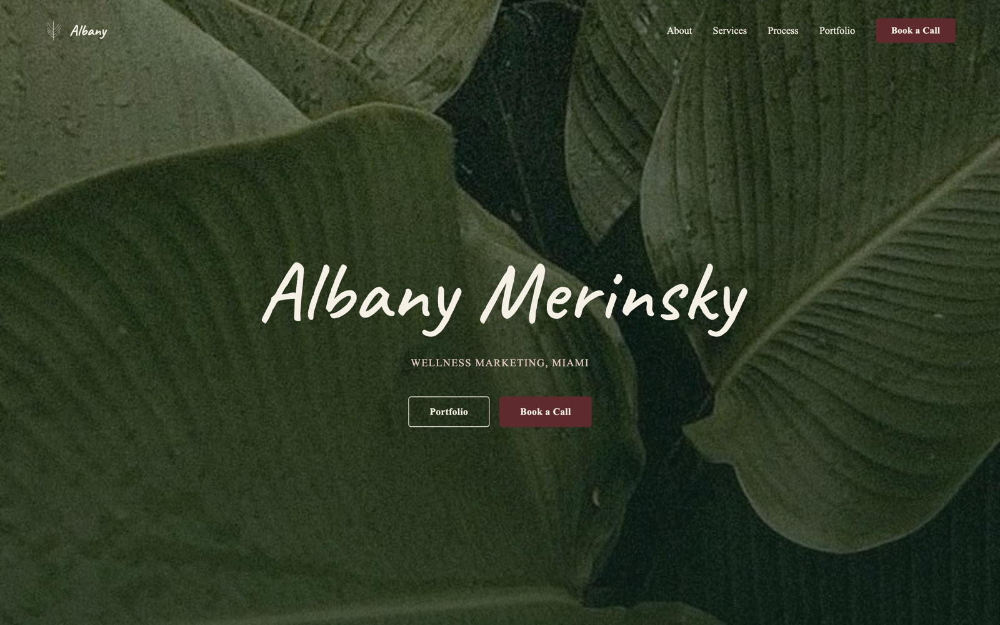
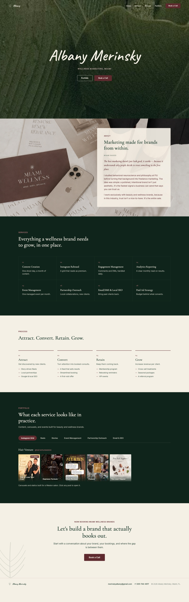

# Albany Merinsky — Portfolio Site

Freelance wellness-marketing portfolio for a Miami-based brand consultant.
A static site with **no framework, no build step and no dependencies** — just
`index.html`, `styles.css`, `main.js` and `assets/`.

**Live:** <https://banymerinsky.github.io/portfolio/>



<details>
<summary><b>Preview the full page</b></summary>

<br>



</details>

## What's here

| Section | Contents |
|---|---|
| **Hero** | Animated typewriter title over a full-bleed leaf photograph |
| **About** | Positioning statement with a scroll-triggered colour reveal |
| **Services** | Eight offerings, from content creation to paid ad strategy |
| **Process** | Four stages — Attract, Convert, Retain, Grow — revealed on a stagger |
| **Portfolio** | Six tabbed panels with a carousel lightbox for slides and reels |
| **Contact** | Slide-out drawer with a prefilled `mailto:` compose |

## Running it locally

```bash
python3 -m http.server 8787
```

Then open <http://localhost:8787>.

**Hard-reload after any change.** The browser caches CSS and HTML aggressively
here, and a stale stylesheet reliably looks like a layout bug rather than a
caching one.

## Structure

```
index.html      markup for every section
styles.css      all styling, including the design tokens below
main.js         typewriter, reveals, tabs, lightbox, contact drawer
assets/         hero photography and the three event reels
assets/hv/      Hair Venture carousel slides and reels
docs/           preview images for this README (not part of the site)
```

## Design notes

The palette and type are held to exact values — they are not rounded or snapped
to a 4/8px grid.

| Token | Value | | Token | Value |
|---|---|---|---|---|
| cream | `#F5F0E6` | | rose | `#B5757A` |
| green | `#1B3A2B` | | blush | `#E4C9C4` |
| maroon | `#5E2A2E` | | gold (button hover) | `#DCC38C` |
| dark | `#0F241A` | | line | `#D8C9BB` |

Cormorant Garamond sets the headings, Caveat the logo and hero, and Inter the
body copy. **Times New Roman on the nav links, hero eyebrow and buttons is
deliberate, not a bug** — it is what the design specifies.

Motion timings are likewise exact: a 145ms-per-character typewriter, a 0.28s
process stagger across 1.2s, and an about-copy fade from green to maroon over
1.1s.

## Things that look like bugs but aren't

- **`.post img` needs `height: auto`.** The `width`/`height` attributes on those
  `` tags are presentational hints that otherwise pin the height, defeat
  `aspect-ratio`, and render the tiles 1350px tall.
- **The 15vw hero rule under 380px is load-bearing.** The hero title is
  `white-space: nowrap` at roughly 5.8× its font size; the 56px clamp floor
  overflows viewports narrower than ~365px. Removing the rule clips the title on
  small phones.
- **`background-attachment: fixed` falls back to `scroll` on touch devices on
  purpose.** It jitters on iOS otherwise.

## Accessibility

The mockup specified visuals only. Built on top of it: full keyboard and ARIA
support, focus management and scroll locking for the lightbox and contact
drawer, a `prefers-reduced-motion` path, and a real prefilled `mailto:` compose
on the contact form — there is no backend.

## Deployment

GitHub Pages serves `main` from the repository root. Pushing to `main`
redeploys; `.nojekyll` disables Jekyll processing.

Media is committed directly rather than through Git LFS. **Do not move it to
LFS** — GitHub Pages serves LFS pointers as plain text, which would break every
video on the live site.

## Known work

The PNGs in `assets/` are 1.5–3.4 MB each and should be converted to WebP; a
first load currently pulls tens of megabytes.
